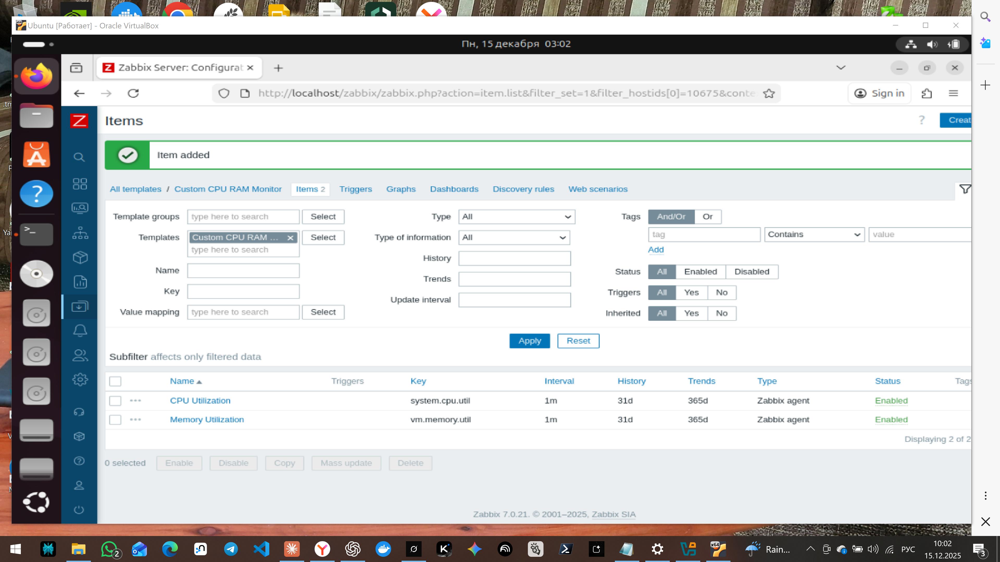

## Задание 1

Создан шаблон "Custom CPU RAM Monitor" с элементами данных для мониторинга CPU и RAM.

## Задания 2-3

Добавлены в Zabbix два хоста и заданы им имена pakvm-1 и pakvm-2

## Задание 4 

Создан свой кастомный дашборд.
Custom Monitoring Dashboard

